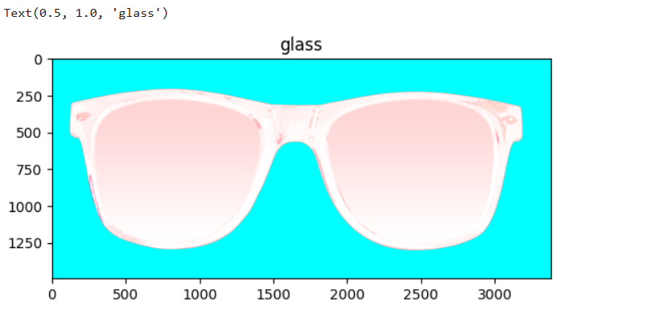

# Sturdy-Octo-Disco-Adding-Sunglasses-for-a-Cool-New-Look

Sturdy Octo Disco is a fun project that adds sunglasses to photos using image processing.

Welcome to Sturdy Octo Disco, a fun and creative project designed to overlay sunglasses on individual passport photos! This repository demonstrates how to use image processing techniques to create a playful transformation, making ordinary photos look extraordinary. Whether you're a beginner exploring computer vision or just looking for a quirky project to try, this is for you!

## Features:
- Detects the face in an image.
- Places a stylish sunglass overlay perfectly on the face.
- Works seamlessly with individual passport-size photos.
- Customizable for different sunglasses styles or photo types.

## Technologies Used:
- Python
- OpenCV for image processing
- Numpy for array manipulations

## How to Use:
1. Clone this repository.
2. Add your passport-sized photo to the `images` folder.
3. Run the script to see your "cool" transformation!

## Applications:
- Learning basic image processing techniques.
- Adding flair to your photos for fun.
- Practicing computer vision workflows.

## Program:
### Name:Vikaash K S
### Reg.no:212223240179

```python
import cv2
import numpy as np
import matplotlib.pyplot as plt

img = cv2.imread('mypic.png')
plt.imshow(img[:,:,::-1]);plt.title("Face")

glassPNG=cv2.imread('glass.png',-1)
plt.imshow(glassPNG[:,:,::-1]);plt.title("glass")

glassPNG = cv2.resize(glassPNG,(200,60))
print("image Dimension =",glassPNG.shape)

glassBGR = glassPNG[:,:,0:3]
glassMask1 = glassPNG[:,:,3]
plt.figure(figsize=[15,15])
plt.subplot(121);plt.imshow(glassBGR[:,:,::-1]);plt.tit('Sunglass Color channels');
plt.subplot(122);plt.imshow(glassMask1,cmap='gray');plt.title('Sunglass Alpha channel');

faceWithGlasses= img.copy()
faceWithGlasses[160:220,105:305]=glassBGR
plt.imshow(faceWithGlasses[...,::-1])

glassMask = cv2.merge((glassMask1,glassMask1,glassMask1))
glassMask = np.uint8(glassMask/255)
faceWithGlassesArithmetic = img.copy()
eyeROI= faceWithGlassesArithmetic[160:220,105:305]
maskedEye = cv2.multiply(eyeROI,(1-  glassMask ))
maskedGlass = cv2.multiply(glassBGR,glassMask)
eyeRoiFinal = cv2.add(maskedEye, maskedGlass)
plt.figure(figsize=[20,20])
plt.subplot(131);plt.imshow(maskedEye[...,::-1]);plt.title("Masked Eye Region")
plt.subplot(132);plt.imshow(maskedGlass[...,::-1]);plt.title("Masked Sunglass Region")
plt.subplot(133);plt.imshow(eyeRoiFinal[...,::-1]);plt.title("Augmented Eye and Sunglass")

faceWithGlassesArithmetic[160:220,105:305]=eyeRoiFinal
plt.figure(figsize=[10,10]);
plt.subplot(121);plt.imshow(img[:,:,::-1]); plt.title("Original Image");
plt.subplot(122);plt.imshow(faceWithGlassesArithmetic[:,:,::-1]);plt.title("With Sunglasses");
```
## Output:
### 1.Original image:


### 2.Glass:


### 3.Glass color channel:


### 4.Face With Glass:


### 5.Eye and glass region:


### 6.Final image with glass:


## Result:
Thus, the creative project designed to overlay sunglasses on individual passport size photo has been successfully executed.